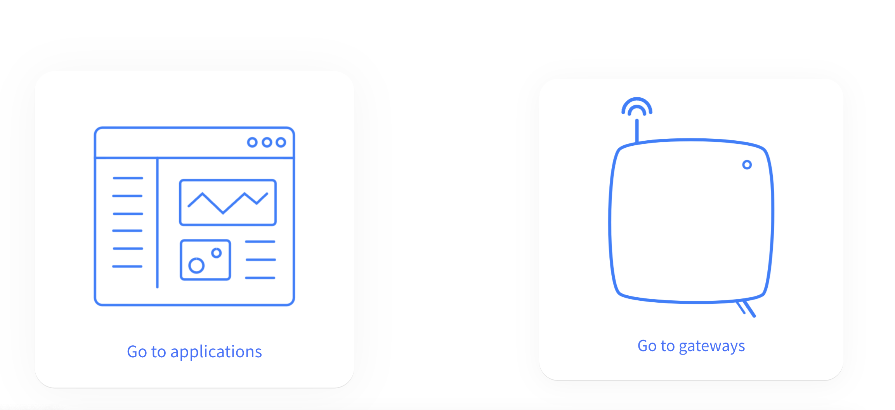
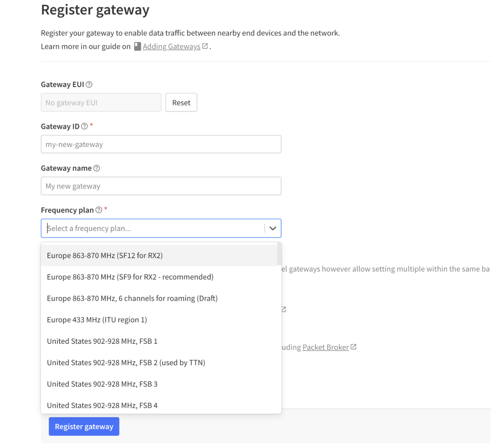
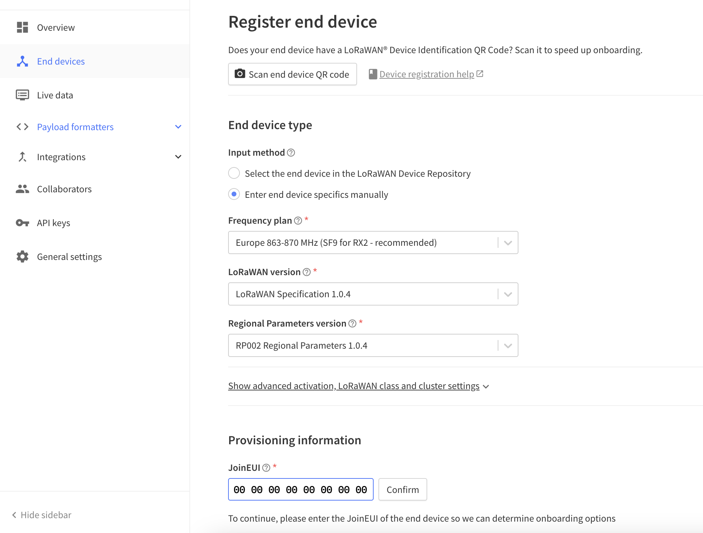
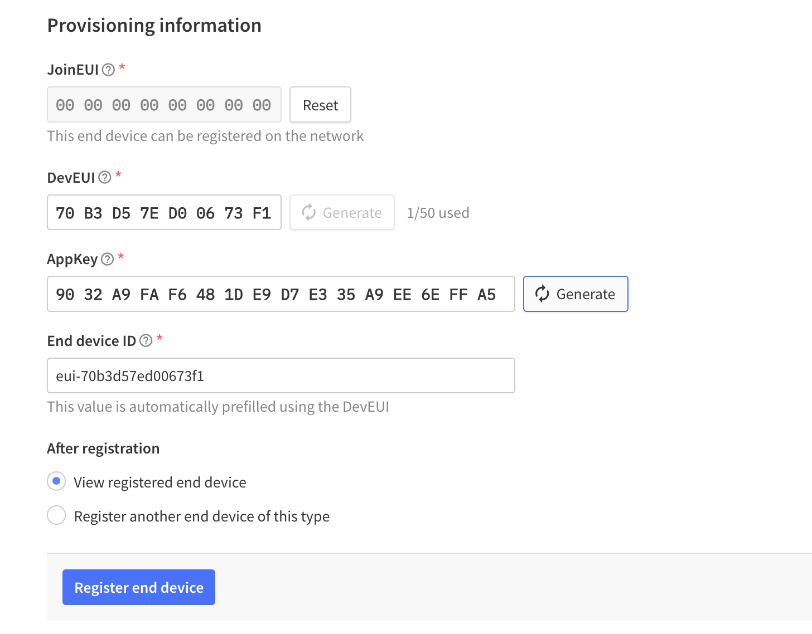
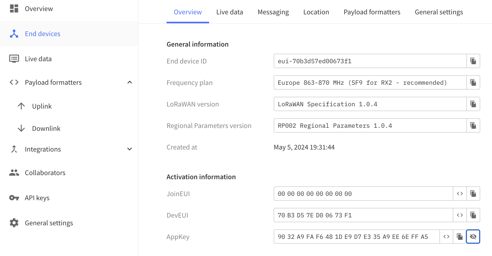
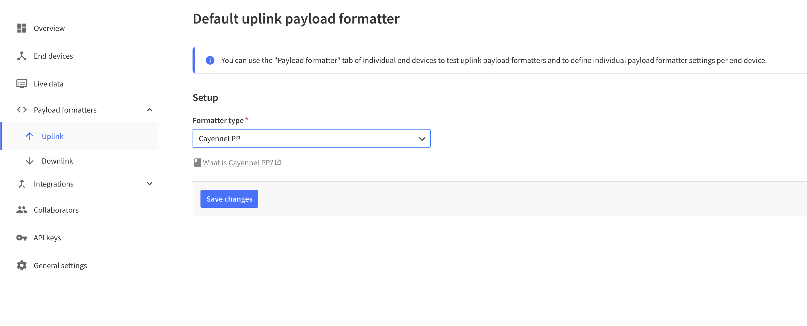
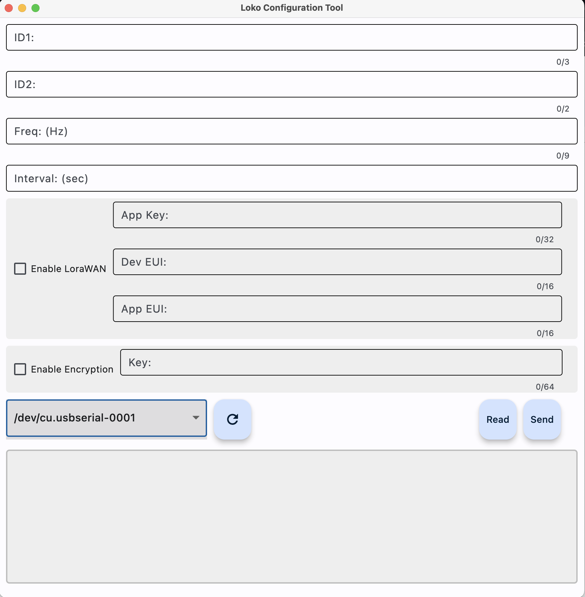
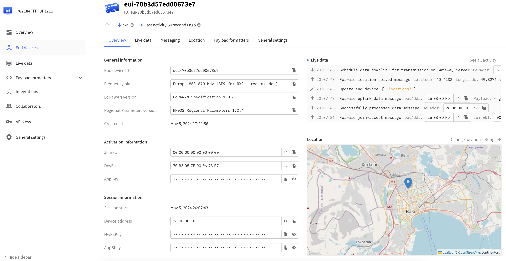

# Loko

## Step-by-Step Guide to Connecting Your Gateway and Loko on The Things Network

## Steps

1. Go to The Things Network website, and open an account.
2. Go to Console page. Profile Icon -> Console.
3. Choose your region, and a page with two options will appear: “Go To Applications” and “Go To Gateways”.
4. If you are adding your own gateway, first set it up according to the manufacturer's documentation.
5. Choose “Go To Gateways” for adding a gateway. Click on Register Gateway to register your own gateway. You can use publicly available gateways as well if available in your region, which might cost a fee.
6. To register your gateway, choose the appropriate frequency plan for your region.
7. Use the Gateway ID obtained during setup to connect to the internet. Register the gateway using the recommended frequency plan.

   _Figure 1: Loko Device Setup_

8. After registering your device, go back to the “Go to Applications” section. Click on the “Create Application” button and give a Name/ID to your application.

   _Figure 2: Gateway Configuration_

9. Click on the “register end device” button on your newly created application page. Enter end device specifics manually. For the JoinEUI, you can put anything corresponding to APP-EUI settings on the Loko Configuration Tools app.

   _Figure 2: Gateway Configuration_

10. Click on the Confirm button. More settings will appear. Press the generate buttons to create Dev-Eui and App-Key. Then click on register end device button.

   _Figure 2: Gateway Configuration_

11. You can see the device parameters from the overview. You will need the activation parameters to set up the Loko Air unit using the configuration tool.

   _Figure 2: Gateway Configuration_

12. Go to payload formatters and choose CayanneLPP for the uplink. Done with this site settings.

   _Figure 2: Gateway Configuration_

13. Open the Loko Configuration Tool app, select port and press read to read the settings.

   _Figure 2: Gateway Configuration_

14. Enable LoRaWan and fill out the required parameters. Parameters should match the TheThingsNetwork page's End device activation information. AppEUI is JoinEUI, and others are the same as on the website.
15. Press send button and wait a few seconds. Restart the Loko Air unit.
16. On the End Device page of TheThingsNetwork website, you should see live data once the gateway receives Loko information. Live data and the Loko air unit location will appear on the map.

   _Figure 2: Gateway Configuration_

<!-- 2. **Gateway Setup**:
   - Follow manufacturer’s documentation to set up your gateway.
   - Register your gateway on The Things Network.
   
   _Figure 1: Loko Device Setup_

   
   _Figure 2: Gateway Configuration_

3. **Application Setup**:
   - Create a new application and register end devices.
   - Use the recommended frequency plan and configure the settings accordingly.

4. **Device Configuration**:
   - Use the Loko Configuration Tool to set the parameters for LoRaWAN.
   - Enable LoRaWAN and enter the required parameters.
   - Restart the Loko Air unit.

5. **Live Data Monitoring**:
   - Monitor live data and device location on The Things Network console. -->

## Firmware Update
## Configuration
1. **Loko Air Configuration**: 
   - Open an account on The Things Network website.
   - Go to the Console page and select your region.

2. **Loko Ground COnfiguration**:
   - Follow manufacturer’s documentation to set up your gateway.
   - Register your gateway on The Things Network.
