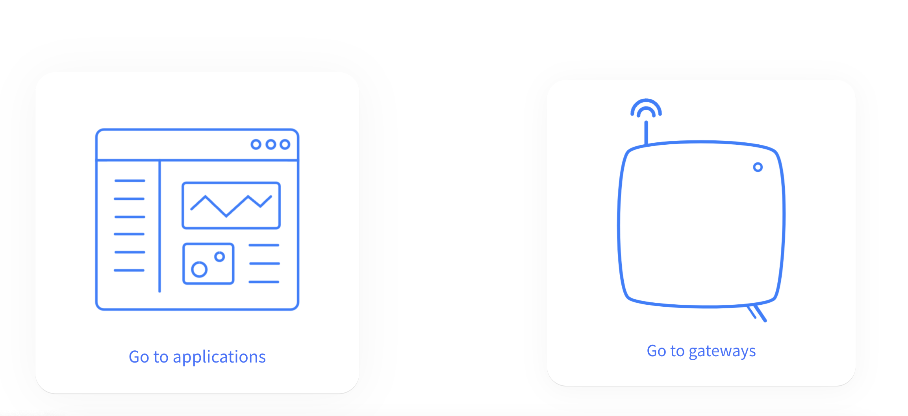
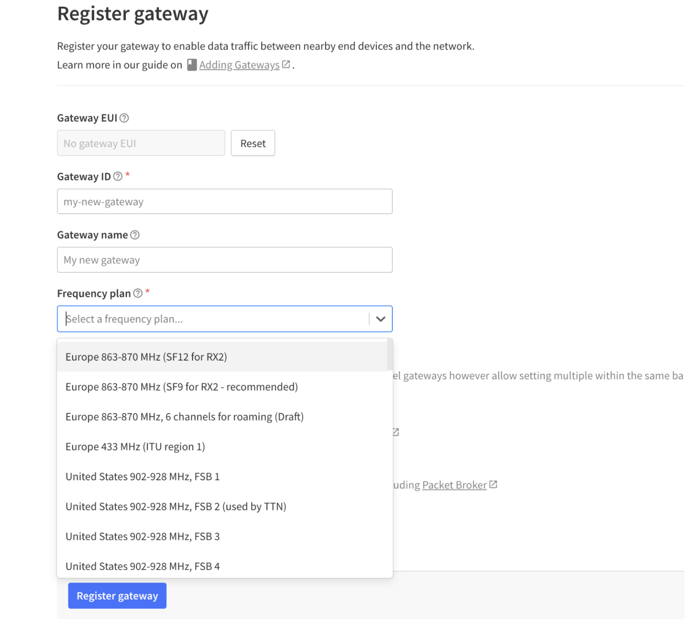

# Loko

## Step-by-Step Guide to Connecting Your Gateway and Loko on The Things Network

1. **Account Setup**: 
   - Open an account on The Things Network website.
   - Go to the Console page and select your region.

2. **Gateway Setup**:
   - Follow manufacturer’s documentation to set up your gateway.
   - Register your gateway on The Things Network.
   
   _Figure 1: Loko Device Setup_

   
   _Figure 2: Gateway Configuration_

3. **Application Setup**:
   - Create a new application and register end devices.
   - Use the recommended frequency plan and configure the settings accordingly.

4. **Device Configuration**:
   - Use the Loko Configuration Tool to set the parameters for LoRaWAN.
   - Enable LoRaWAN and enter the required parameters.
   - Restart the Loko Air unit.

5. **Live Data Monitoring**:
   - Monitor live data and device location on The Things Network console.

For more detailed instructions, visit the [LoRaWAN guide on nolilab.com](https://nolilab.com/pages/lorawan).

## Firmware Update
## Configuration
1. **Loko Air Configuration**: 
   - Open an account on The Things Network website.
   - Go to the Console page and select your region.

2. **Loko Ground COnfiguration**:
   - Follow manufacturer’s documentation to set up your gateway.
   - Register your gateway on The Things Network.
